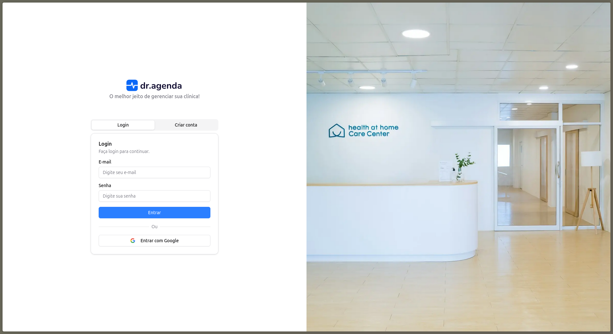
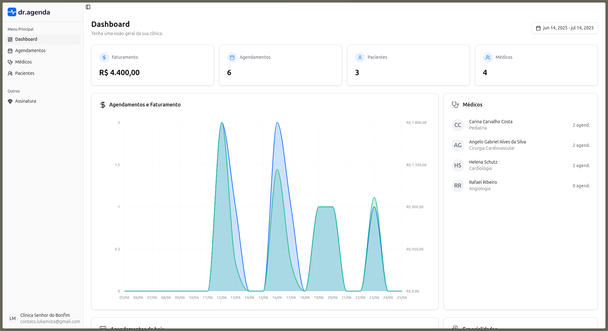
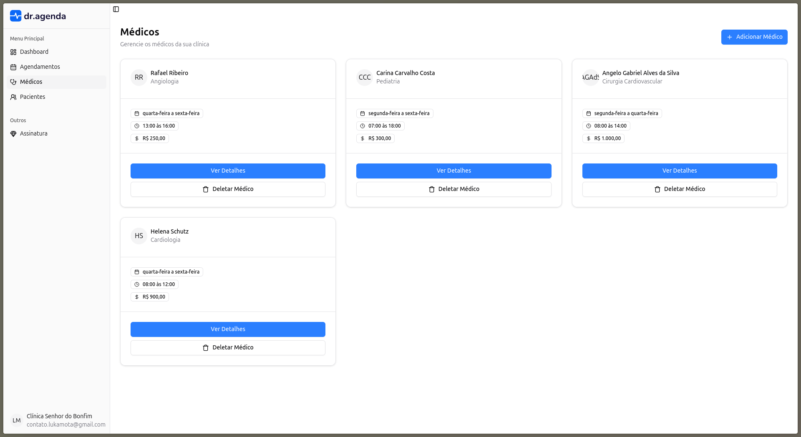
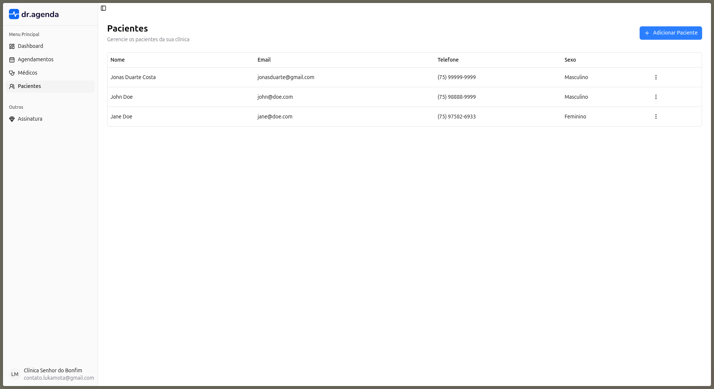
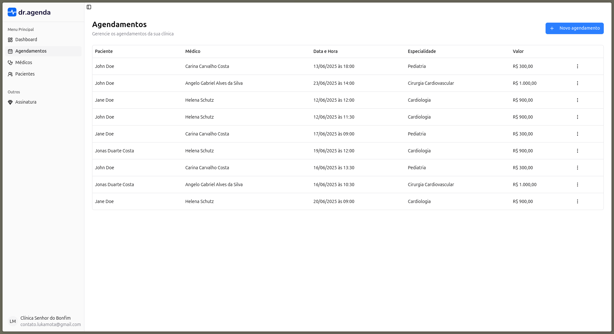
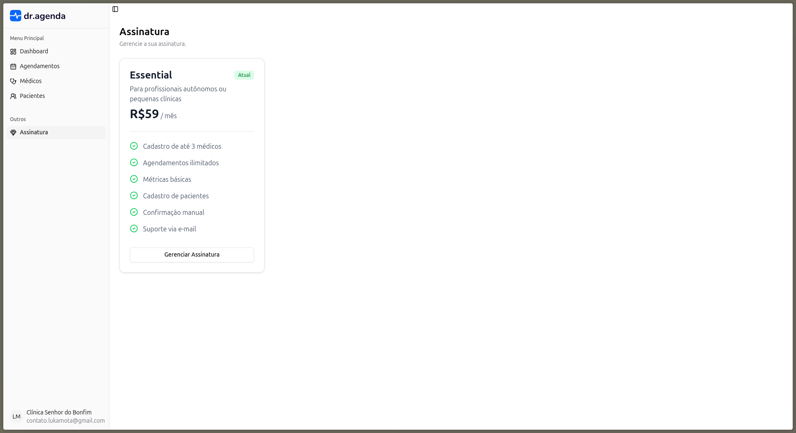

  

> **Dr. Agenda** é uma plataforma web para gestão de clínicas médicas, permitindo o gerenciamento de profissionais, pacientes, agendamentos e controle de disponibilidade de horários de forma simples e eficiente.

  <a href="#-funcionalidades">Funcionalides</a>&nbsp;&nbsp;&nbsp;|&nbsp;&nbsp;&nbsp;
  <a href="#-tecnologias-utilizadas">Tecnologias Utilizadas</a>&nbsp;&nbsp;&nbsp;|&nbsp;&nbsp;&nbsp;
  <a href="#-imagens-do-projeto">Imagens do Projeto</a>

 

  

## 🚀 Funcionalidades

- Cadastro e Autenticação de Usuários (incluindo login social com Google)
- Criação e Gerenciamento de Clínicas
- Cadastro, listagem, atualização e exclusão de médicos
- Controle de agenda e horários disponíveis para agendamento
- Cadastro e Gerenciamento de Pacientes
- Visualização de estatísticas e gráficos do consultório
- Integração com Stripe para pagamentos e assinaturas

## 💻 Tecnologias Utilizadas

- **Next.js** — Framework React para aplicações web modernas
- **TypeScript** — Tipagem estática para maior segurança
- **Drizzle ORM** — Mapeamento objeto-relacional para banco de dados
- **Tailwind CSS** — Estilização rápida e responsiva
- **shadcn/ui** — Componentes de UI acessíveis e customizáveis
- **ESLint & Prettier** — Padronização e qualidade de código
- **Stripe** — Pagamentos e assinaturas

## Imagens do Projeto

> Veja imagens abaixo do sistema em funcionamento.

### Tela de Login

### Dashboard

### Listagem de Médicos

### Listagem de Pacientes

### Listagem de Agendamentos

### Assinatura

